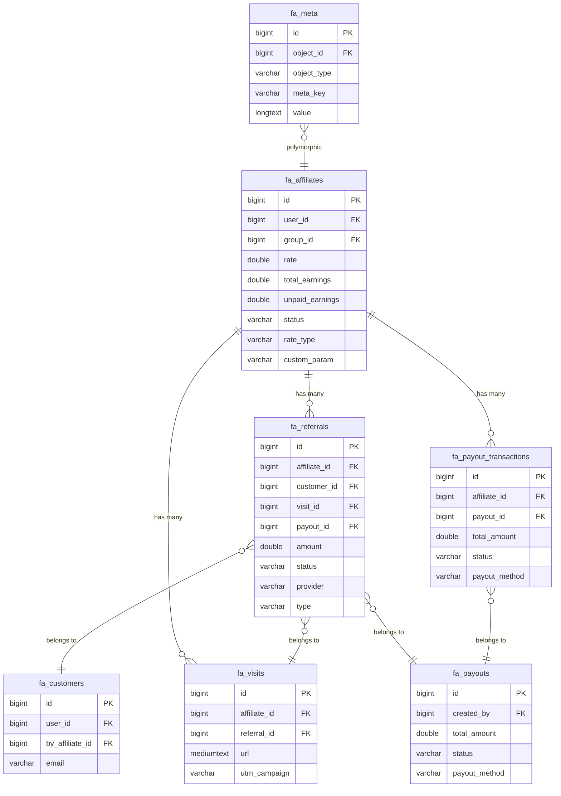

# Database Schema

FluentAffiliate uses **custom database tables** (not WordPress post types). All tables are prefixed with `fa_` in addition to the WordPress table prefix (`$wpdb->prefix`).

## Table Inventory

| Table | Description |
|-------|-------------|
| [`fa_affiliates`](#fa-affiliates) | Represents a registered affiliate. Central model in FluentAffiliate. |
| [`fa_referrals`](#fa-referrals) | Represents a commission event generated when a referred visitor completes a qualifying action. |
| [`fa_payouts`](#fa-payouts) | A payout batch grouping multiple affiliate transactions. |
| [`fa_payout_transactions`](#fa-payout-transactions) | An individual payout transaction for a single affiliate within a payout batch. |
| [`fa_visits`](#fa-visits) | Tracks each click of an affiliate referral link. |
| [`fa_customers`](#fa-customers) | A customer who made a purchase through an affiliate link. |
| [`fa_meta`](#fa-meta) | Generic key-value meta storage for affiliate and other objects. |
| [`fa_creatives`](#fa-creatives) | A marketing creative asset (banner, image, or text) managed in FluentAffiliate Pro. PRO |

## Entity Relationships

## `fa_affiliates`

Represents a registered affiliate. Central model in FluentAffiliate.

**Model class:** [`Affiliate`](/database/models/affiliates)

| Column | Type | Nullable | Default | Description |
|--------|------|----------|---------|-------------|
| `id` | `BIGINT(20)` | NO | — | Primary key, auto-increment. |
| `contact_id` | `BIGINT(20)` | YES | — | Optional FluentCRM contact ID linked to this affiliate. |
| `user_id` | `BIGINT(20)` | YES | — | WordPress user ID of the affiliate. |
| `group_id` | `BIGINT(20)` | YES | — | Affiliate group ID (Pro feature). |
| `rate` | `DOUBLE` | YES | `NULL` | Commission rate. Interpretation depends on `rate_type`. |
| `total_earnings` | `DOUBLE` | YES | `0` | Cumulative lifetime earnings (denormalised). |
| `unpaid_earnings` | `DOUBLE` | YES | `0` | Earnings not yet included in a paid payout. |
| `referrals` | `BIGINT(20)` | YES | `0` | Total referral count (denormalised). |
| `visits` | `BIGINT(20)` | YES | `0` | Total visit count (denormalised). |
| `lead_counts` | `BIGINT(20)` | YES | `0` | Total lead count (denormalised). |
| `rate_type` | `VARCHAR(100)` | YES | `percentage` | Commission type — `percentage` or `flat`. |
| `custom_param` | `VARCHAR(100)` | YES | — | Custom URL parameter value used for tracking. |
| `payment_email` | `VARCHAR(192)` | YES | — | Email address used for payout delivery. |
| `status` | `VARCHAR(100)` | YES | `active` | Record status. |
| `settings` | `LONGTEXT` | YES | — | Serialized JSON settings blob. |
| `note` | `LONGTEXT` | YES | — | Internal admin notes about the affiliate. |
| `created_at` | `TIMESTAMP` | YES | — | Timestamp when the record was created. |
| `updated_at` | `TIMESTAMP` | YES | — | Timestamp when the record was last updated. |

## `fa_referrals`

Represents a commission event generated when a referred visitor completes a qualifying action.

**Model class:** [`Referral`](/database/models/referrals)

| Column | Type | Nullable | Default | Description |
|--------|------|----------|---------|-------------|
| `id` | `BIGINT(20)` | NO | — | Primary key, auto-increment. |
| `affiliate_id` | `BIGINT(20)` | YES | — | Affiliate who earned this referral. |
| `parent_id` | `BIGINT(20)` | YES | — | Parent referral ID (for multi-tier, reserved). |
| `customer_id` | `BIGINT(20)` | YES | — | Customer record associated with this purchase. |
| `visit_id` | `BIGINT(20)` | YES | — | Visit that initiated this referral (if known). |
| `description` | `LONGTEXT` | YES | — | Free-text description. |
| `status` | `VARCHAR(100)` | YES | `pending` | Record status. |
| `amount` | `DOUBLE` | YES | `NULL` | Commission amount earned by the affiliate. |
| `order_total` | `DOUBLE` | YES | `NULL` | Total order value that generated the referral. |
| `currency` | `CHAR(3)` | YES | — | ISO 4217 currency code (e.g. `USD`). |
| `utm_campaign` | `VARCHAR(100)` | YES | — | UTM campaign parameter from the tracking URL. |
| `provider` | `VARCHAR(100)` | YES | — | Integration slug that created this referral (e.g. `woo`, `fluentcart`). |
| `provider_id` | `BIGINT(20)` | YES | — | Provider-specific order/payment numeric ID. |
| `provider_sub_id` | `VARCHAR(192)` | YES | — | Provider-specific sub-ID (e.g. subscription ID). |
| `products` | `LONGTEXT` | YES | — | JSON list of product IDs in the order. |
| `payout_transaction_id` | `BIGINT(20)` | YES | — | Payout transaction that included this referral. |
| `payout_id` | `BIGINT(20)` | YES | — | Parent payout record. |
| `type` | `VARCHAR(100)` | YES | `sale` | Creative type — `image`, `text`, `html`, `banner`. |
| `settings` | `LONGTEXT` | YES | — | Serialized JSON settings blob. |
| `created_at` | `TIMESTAMP` | YES | — | Timestamp when the record was created. |
| `updated_at` | `TIMESTAMP` | YES | — | Timestamp when the record was last updated. |

## `fa_payouts`

A payout batch grouping multiple affiliate transactions.

**Model class:** [`Payout`](/database/models/payouts)

| Column | Type | Nullable | Default | Description |
|--------|------|----------|---------|-------------|
| `id` | `BIGINT(20)` | NO | — | Primary key, auto-increment. |
| `created_by` | `BIGINT(20)` | YES | — | WordPress user ID of the admin who created the payout. |
| `total_amount` | `DOUBLE` | YES | `NULL` | Sum of all transactions in this payout. |
| `payout_method` | `VARCHAR(100)` | YES | `manual` | Delivery method — `manual`, `paypal`, etc. |
| `status` | `VARCHAR(100)` | YES | `draft` | Record status. |
| `currency` | `CHAR(3)` | YES | — | ISO 4217 currency code (e.g. `USD`). |
| `title` | `VARCHAR(192)` | YES | — | Human-readable payout title. |
| `description` | `LONGTEXT` | YES | — | Free-text description. |
| `settings` | `LONGTEXT` | YES | — | Serialized JSON settings blob. |
| `created_at` | `TIMESTAMP` | YES | — | Timestamp when the record was created. |
| `updated_at` | `TIMESTAMP` | YES | — | Timestamp when the record was last updated. |

## `fa_payout_transactions`

An individual payout transaction for a single affiliate within a payout batch.

**Model class:** [`Transaction`](/database/models/payout-transactions)

| Column | Type | Nullable | Default | Description |
|--------|------|----------|---------|-------------|
| `id` | `BIGINT(20)` | NO | — | Primary key, auto-increment. |
| `created_by` | `BIGINT(20)` | YES | — | WordPress user ID of the admin who created the payout. |
| `affiliate_id` | `BIGINT(20)` | YES | — | Affiliate who earned this referral. |
| `payout_id` | `BIGINT(20)` | YES | — | Parent payout record. |
| `total_amount` | `DOUBLE` | YES | `0` | Sum of all transactions in this payout. |
| `payout_method` | `VARCHAR(100)` | YES | `manual` | Delivery method — `manual`, `paypal`, etc. |
| `status` | `VARCHAR(100)` | YES | `paid` | Record status. |
| `currency` | `CHAR(3)` | YES | — | ISO 4217 currency code (e.g. `USD`). |
| `settings` | `LONGTEXT` | YES | — | Serialized JSON settings blob. |
| `created_at` | `TIMESTAMP` | YES | — | Timestamp when the record was created. |
| `updated_at` | `TIMESTAMP` | YES | — | Timestamp when the record was last updated. |

## `fa_visits`

Tracks each click of an affiliate referral link.

**Model class:** [`Visit`](/database/models/visits)

| Column | Type | Nullable | Default | Description |
|--------|------|----------|---------|-------------|
| `id` | `BIGINT(20)` | NO | — | Primary key, auto-increment. |
| `affiliate_id` | `BIGINT(20)` | YES | — | Affiliate who earned this referral. |
| `user_id` | `BIGINT(20)` | YES | — | WordPress user ID of the affiliate. |
| `referral_id` | `BIGINT(20)` | YES | — | Referral created from this visit (if any). |
| `url` | `MEDIUMTEXT` | YES | — | Destination URL linked from the creative. |
| `referrer` | `MEDIUMTEXT` | YES | — | HTTP referer of the visit. |
| `utm_campaign` | `VARCHAR(100)` | YES | — | UTM campaign parameter from the tracking URL. |
| `utm_medium` | `VARCHAR(100)` | YES | — | UTM medium parameter. |
| `utm_source` | `VARCHAR(100)` | YES | — | UTM source parameter. |
| `ip` | `VARCHAR(100)` | YES | — | Hashed or raw visitor IP address. |
| `created_at` | `TIMESTAMP` | YES | — | Timestamp when the record was created. |
| `updated_at` | `TIMESTAMP` | YES | — | Timestamp when the record was last updated. |

## `fa_customers`

A customer who made a purchase through an affiliate link.

**Model class:** [`Customer`](/database/models/customers)

| Column | Type | Nullable | Default | Description |
|--------|------|----------|---------|-------------|
| `id` | `BIGINT(20)` | NO | — | Primary key, auto-increment. |
| `user_id` | `BIGINT(20)` | YES | — | WordPress user ID of the affiliate. |
| `by_affiliate_id` | `BIGINT(20)` | YES | — | Affiliate who referred this customer. |
| `email` | `VARCHAR(192)` | YES | — | Customer email address. |
| `first_name` | `VARCHAR(192)` | YES | — | Customer first name. |
| `last_name` | `VARCHAR(192)` | YES | — | Customer last name. |
| `ip` | `VARCHAR(100)` | YES | — | Hashed or raw visitor IP address. |
| `settings` | `LONGTEXT` | YES | — | Serialized JSON settings blob. |
| `created_at` | `TIMESTAMP` | YES | — | Timestamp when the record was created. |
| `updated_at` | `TIMESTAMP` | YES | — | Timestamp when the record was last updated. |

## `fa_meta`

Generic key-value meta storage for affiliate and other objects.

**Model class:** [`Meta`](/database/models/meta)

| Column | Type | Nullable | Default | Description |
|--------|------|----------|---------|-------------|
| `id` | `BIGINT` | NO | — | Primary key, auto-increment. |
| `object_type` | `VARCHAR(50)` | NO | — | Type of object this meta belongs to (e.g. `affiliate`). |
| `object_id` | `BIGINT` | YES | — | ID of the associated object. |
| `meta_key` | `VARCHAR(192)` | NO | — | Meta key. |
| `value` | `LONGTEXT` | YES | — | Meta value (serialized if complex). |
| `created_at` | `TIMESTAMP` | YES | — | Timestamp when the record was created. |
| `updated_at` | `TIMESTAMP` | YES | — | Timestamp when the record was last updated. |

## `fa_creatives` PRO

A marketing creative asset (banner, image, or text) managed in FluentAffiliate Pro.

**Model class:** [`Creative`](/database/models/creatives)

| Column | Type | Nullable | Default | Description |
|--------|------|----------|---------|-------------|
| `id` | `BIGINT(20)` | NO | — | Primary key, auto-increment. |
| `name` | `VARCHAR(255)` | NO | — | Creative asset name. |
| `description` | `TEXT` | YES | — | Free-text description. |
| `type` | `VARCHAR(100)` | NO | — | Creative type — `image`, `text`, `html`, `banner`. |
| `image` | `TEXT` | YES | — | URL of the creative image asset. |
| `text` | `TEXT` | YES | — | Text content for text-type creatives. |
| `url` | `TEXT` | YES | — | Destination URL linked from the creative. |
| `privacy` | `VARCHAR(100)` | YES | `public` | Visibility — `public` or `private`. |
| `status` | `VARCHAR(100)` | YES | `active` | Record status. |
| `affiliate_ids` | `JSON` | YES | — | JSON array of affiliate IDs this creative is restricted to. |
| `group_ids` | `JSON` | YES | — | JSON array of group IDs this creative is restricted to. |
| `meta` | `LONGTEXT` | YES | — | Additional metadata for the creative. |
| `created_at` | `TIMESTAMP` | YES | — | Timestamp when the record was created. |
| `updated_at` | `TIMESTAMP` | YES | — | Timestamp when the record was last updated. |
