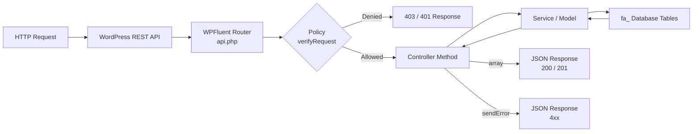

# Getting Started

## Overview

FluentAffiliate is a self-hosted WordPress affiliate program management plugin by WPManageNinja (v1.2.0+). It requires PHP 7.4+ and WordPress 5.0+. The plugin manages affiliates, tracks referrals, processes payouts, and integrates with e-commerce plugins through a two-class connector pattern.

All data is stored in custom database tables (prefixed `fa_`) rather than WordPress post types. There is no dependency on external SaaS services — the plugin runs entirely within your WordPress installation.

## Architecture

**Backend** — MVC using the WPFluent framework (a custom Laravel-inspired framework). Entry point: `fluent-affiliate.php` → `boot/app.php` → Application instance.

| Layer | Description | Location |
|---|---|---|
| Router | WPFluent Router over WP REST API | `app/Http/Routes/api.php` |
| Controllers | PHP classes returning arrays auto-serialized to JSON | `app/Http/Controllers/` |
| Policies | Route-level authorization (one per route group) | `app/Http/Policies/` |
| Models | Eloquent-like ORM on custom `fa_` tables | `app/Models/` |
| Services | Business logic (`AffiliateService`, `PermissionManager`, etc.) | `app/Services/` |
| Hooks | WordPress action/filter registrations and handlers | `app/Hooks/` |
| Integrations | E-commerce connectors (BaseConnector pattern) | `app/Modules/Integrations/` |

**REST API** — Registered at `wp-json/fluent-affiliate/v2/` via `app/Http/Routes/api.php` on the `rest_api_init` hook.

### Request Lifecycle



**Frontend Admin SPA** — Vue 3 + Element Plus, hash routing, served from `resources/admin/`. Compiled output in `assets/admin/`.

**Affiliate Portal SPA** — Separate Vue 3 application, served from `resources/Customer/`. Compiled output in `assets/public/`.

**Background jobs** — WooCommerce Action Scheduler (bundled). Hourly (`fluent_affiliate_scheduled_hour_jobs`) and daily (`fluent_affiliate_scheduled_daily_jobs`) jobs registered during plugin boot.

## Authentication

All REST API endpoints require authentication. Use WordPress Application Passwords for external API clients.

### Application Passwords (recommended)

1. Go to **WordPress Admin → Users → Profile**.
2. Scroll to the **Application Passwords** section.
3. Enter a name for the application, then click **Add New Application Password**.
4. Copy the generated password — it is only shown once.

Pass credentials as a Base64-encoded HTTP Basic Authorization header:

```bash
# Base64-encode username:application_password
curl -H "Authorization: Basic $(echo -n 'admin:xxxx xxxx xxxx xxxx xxxx xxxx' | base64)" \
  https://yoursite.com/wp-json/fluent-affiliate/v2/affiliates
```

### Nonce Authentication (browser / admin SPA)

From a browser context where the user is already logged in to WordPress, use the `X-WP-Nonce` header:

```javascript
fetch('/wp-json/fluent-affiliate/v2/affiliates', {
    headers: { 'X-WP-Nonce': wpApiSettings.nonce }
})
```

The built-in admin SPA injects the nonce as `window.fluentAffiliateAdmin.nonce` and sends it automatically via the internal REST client (`resources/admin/Bits/Rest.js`).

## Response Envelope

All API responses are JSON. Successful responses return HTTP `200` (or `201` for creates) with a plain JSON object whose keys depend on the endpoint:

```json
// List response
{ "affiliates": [ { "id": 1, "user_id": 5, "status": "active", ... } ] }

// Single resource
{ "affiliate": { "id": 1, "user_id": 5, ... } }

// Paginated list
{
  "affiliates": [...],
  "total": 142,
  "per_page": 15,
  "current_page": 1,
  "last_page": 10
}

// Mutation success
{ "message": "Affiliate has been created", "affiliate": { ... } }
```

Error responses default to HTTP `422` (or another 4xx code) and always include a `message` key:

```json
{ "message": "The selected group could not be found" }
```

There is no top-level `data` wrapper — the resource key (`affiliates`, `referral`, `payout`, etc.) is always at the root of the response object.

## Authorization

Route groups use policy classes for authorization. Each policy implements `verifyRequest()` for baseline access and per-method checks for granular permissions.

| Policy | Route prefix | Who can access |
|---|---|---|
| AffiliatePolicy | `/affiliates` | Users with `read_all_affiliates` or `manage_all_affiliates` |
| ReferralPolicy | `/referrals` | Users with `read_all_referrals` or `manage_all_referrals` |
| PayoutPolicy | `/payouts` | Users with `read_all_payouts` or `manage_all_payouts` |
| VisitPolicy | `/visits` | Users with `read_all_visits` |
| AdminPolicy | `/settings` | WordPress `manage_options` or `manage_all_data` |
| UserPolicy | `/portal`, `/reports` | Any authenticated WordPress user |

All permission checks delegate to `FluentAffiliate\App\Services\PermissionManager`. WordPress administrators (users with `manage_options`) always pass all policy checks.

## Custom Permissions

FluentAffiliate defines 8 granular permissions that can be assigned to any WordPress user. These are stored as user meta and are independent of WordPress roles.

| Permission | Description |
|---|---|
| `read_all_affiliates` | View all affiliate records |
| `manage_all_affiliates` | Create, update, delete affiliates |
| `read_all_referrals` | View all referrals |
| `manage_all_referrals` | Create, update, delete referrals |
| `read_all_visits` | View visit/click records |
| `read_all_payouts` | View payout batches |
| `manage_all_payouts` | Create and process payouts |
| `manage_all_data` | Full settings and data management access |

Assign permissions programmatically:

```php
update_user_meta( $user_id, '_fa_permissions', [
    'read_all_affiliates',
    'read_all_referrals',
    'read_all_payouts',
] );
```

## Hook Prefix

All custom action and filter hooks use the `fluent_affiliate/` prefix:

```php
do_action('fluent_affiliate/referral_created', $referral);
apply_filters('fluent_affiliate/portal_menu_items', $menuItems);
```

This prefix is consistent across all hooks fired by both the free plugin and the Pro add-on.

## Plugin Constants

| Constant | Description |
|---|---|
| `FLUENT_AFFILIATE_DIR` | Absolute server path to the plugin directory (with trailing slash) |
| `FLUENT_AFFILIATE_URL` | URL to the plugin directory (with trailing slash) |
| `FLUENT_AFFILIATE_VERSION` | Current plugin version string |
| `FLUENT_AFFILIATE_PRO` | Defined (with plugin version) when the Pro add-on is active |

## Pro Plugin

FluentAffiliate Pro extends the core plugin with additional integrations, affiliate groups, creative assets, multi-domain tracking, and subscription renewal commissions. The `FLUENT_AFFILIATE_PRO` constant signals that Pro features are available.

```php
if ( defined( 'FLUENT_AFFILIATE_PRO' ) ) {
    // Pro features are available — safe to call Pro-only APIs
}
```

Endpoints and hooks that require Pro are labeled <span class="pro-badge">PRO</span> throughout this documentation.

## Quick Links

- [Database Schema](/database/schema)
- [Action Hooks](/hooks/actions/)
- [Filter Hooks](/hooks/filters/)
- [REST API Overview](/restapi/)
- [Custom Integration Guide](/guides/custom-integration)
- [Code Snippets](/guides/code-snippets)
